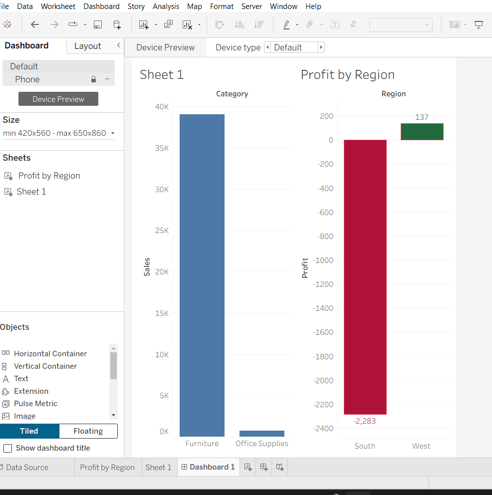

# Superstore Sales & Profit Analysis - Sakshi Pradhan

## 📊 Overview
Analyzed Superstore data (9,994 orders) using MySQL + Tableau. Found critical insight: South region is in LOSS despite sales.

## 🔴🟢 Key Dashboard (Red-Green Logic)

- **South: -$2,283 LOSS = RED** - Urgent action needed
- **West: +$137 PROFIT = GREEN** - Profitable
- **Furniture: 39K Sales** - 98% of business
- **Office Supplies: 0.5K Sales** - Low

**Color Logic:** Profit < 0 = Red, Profit > 0 = Green (Center at 0)

## 🛠️ Tools
- MySQL Workbench - SQL queries (SUM, GROUP BY)
- Tableau Public - Interactive Dashboard
- GitHub - Portfolio

## 📈 SQL Queries Used
```sql
SELECT Region, SUM(Profit) FROM superstore GROUP BY Region;
SELECT Category, SUM(Sales) FROM superstore GROUP BY Category;
